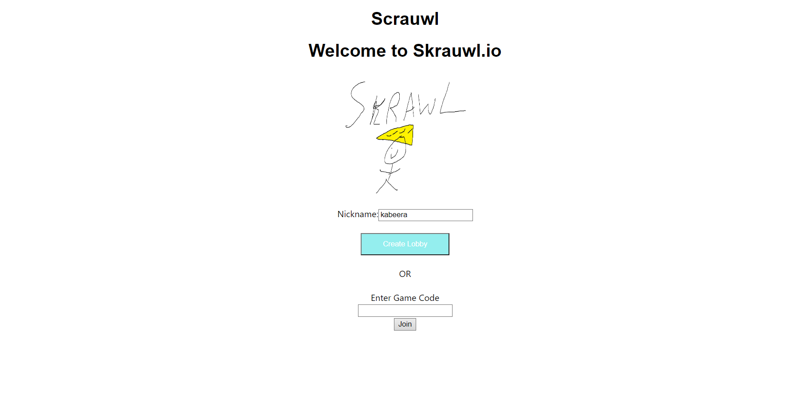
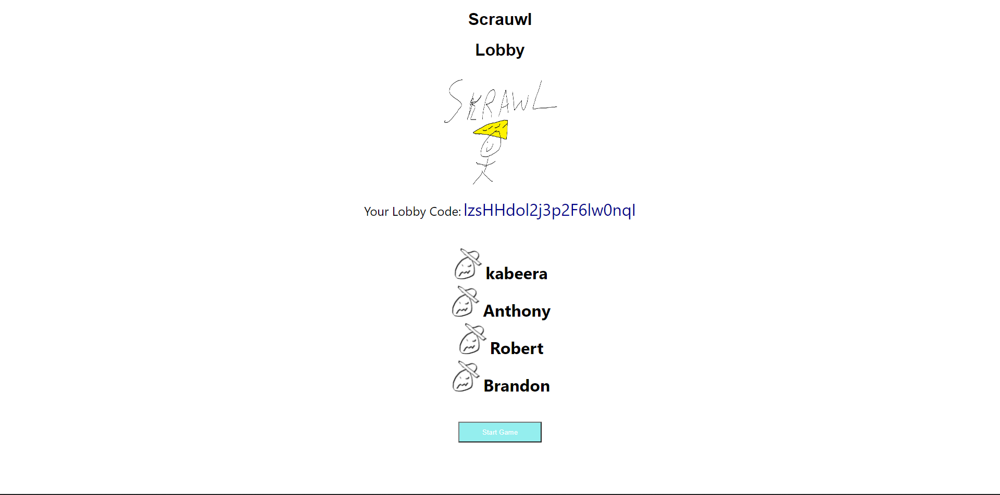
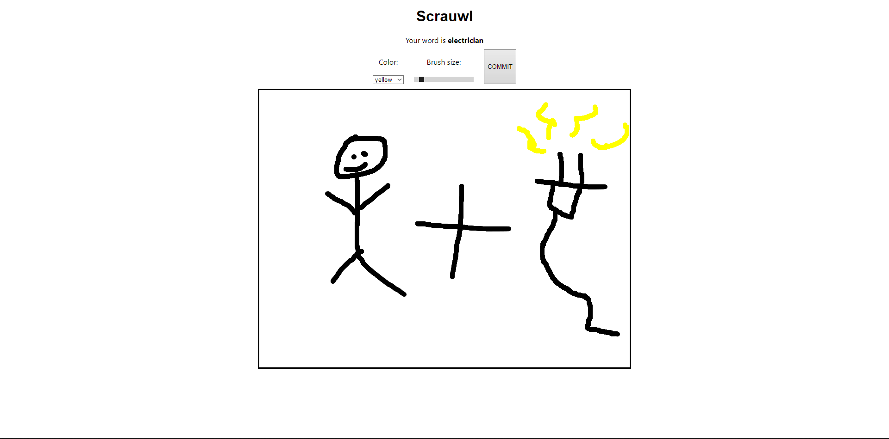
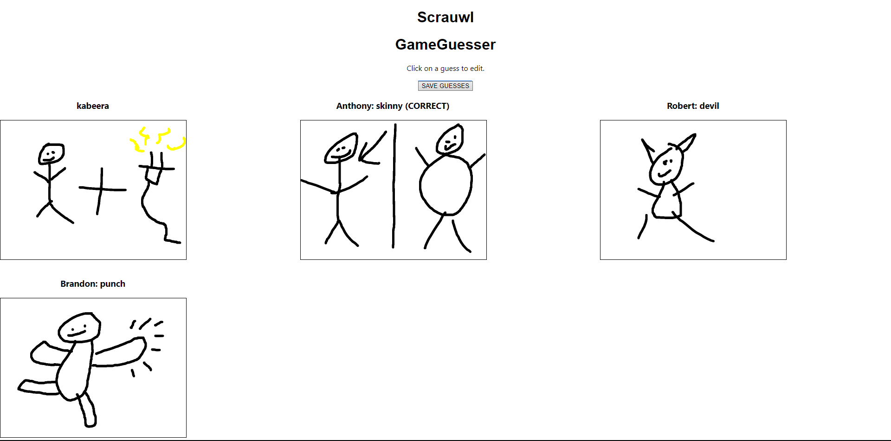
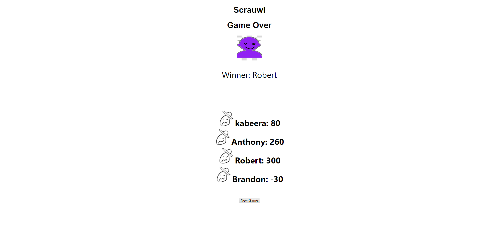

# Milestone 2

## Division of Labor

Kabeera Singh - Kabeera-Singh : Worked on API endpoints, database, and heroku.

Brandon O'Brien Jones - bobrienjones : Frontend - Homepage, Lobby, Endgame Screen

Robert Washbourne - rawsh : Worked on API, setting up node, and connection to frontend.

Anthony Marcone - antchamp : Worked on Game Screen: Drawing, Game Screen: Guessing, and heroku.

## Part 0 - API

### Descriptions

Game_ID: Unique id for each game
Player_ID: Unique id for each player
Canvas: PNG/image object to store player drawings
Guesses: Storing the guesses that the player makes
Score: Score for each player

### Operations

Post:
    New Game:
        Creates a new game and returns the game_id
    New Player:
        Creates a new player and returns the player_id
PUT:
    Update Canvas:
        Updates the canvas for the player
    Update Guesses:
        Updates the guesses for the player
GET:
    Get Game:
        Returns the game by ID
    Get Player:
        Returns the game state for a player
    Get Words:
        Returns the words for the player
    Get Score:
        Returns the score for all players, and also returns the winner
DELETE:
    Delete Game:
        Deletes the game by ID

### Example database

```javascript

{
    games: [
        {
            game_id: 1,
            players: {
                "player_1": {
                    "canvas": (png to string),
                    "guesses": [
                        {"abc": ["cat","dog","mouse"]},
                        {"def": ["cheese","apple","potato"]}
                    ], 
                }
                "player_2": {
                    "canvas": (png to string),
                    "guesses": [
                        {"abc": ["cat","dog","mouse"]},
                        {"def": ["cheese","apple","potato"]}
                    ], 
                }
                "abc": {
                    "canvas": (png to string),
                    "guesses": [
                        {"player_1": ["cat","dog","mouse"]},
                        {"def": ["cheese","apple","potato"]}
                    ], 
                }
            }
            words: {
        billu1: "tangerine",
        billu2: "river",
        billu3: "space suit"
      }
        },
    ]
}
```

## Part 2 - Screenshots and CRUD

The starting page of the game. Each player must enter their name and click the "Start Game" button or paste a game ID into the text box and click join.

Before the game starts, all players are put into a lobby page in which they can see the current players in the game. From here they can click the "Start Game" button to start the game.

The Drawing Screen is where players can draw on the canvas. They will be given a word to draw, and click commit, which will save the drawing to the database. and take them to the next screen.

In the guessing screen each player can then guess what the other players have drawn and if they get it correct, they will get 100 points, but for each wrong guess, they will lose 10 points.

The score screen shows who won the game, and also shows the score for each player.


### Heroku URL
<https://cs326-final-team40.herokuapp.com>
