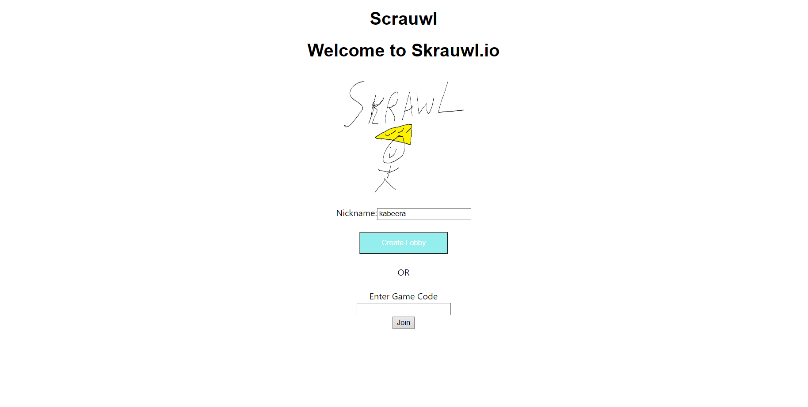
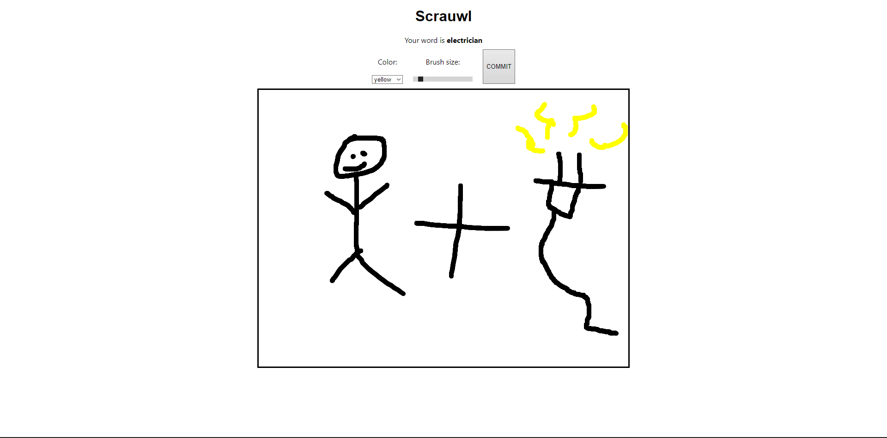
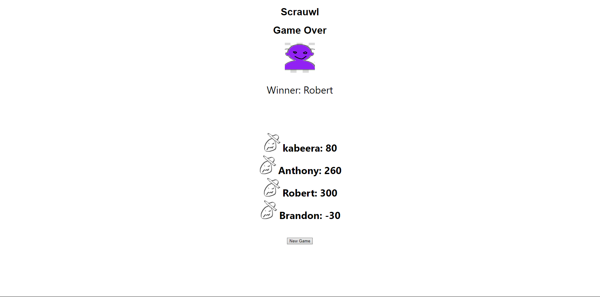

# Milestone 3
## Team 40: Skrawl.io: Spring 2022

# Team 40
## Skrawl.io: Spring 2022


## Innovative Idea

Our application is a game in which a group of people join a lobby, draw a given word, and then try to guess what everyone else has drawn. This application is innovative as it takes the ideas from other web games like gartic.io and scribbl.io and adds a unique twist.
## Part 0 - API

### Descriptions

```
Game_ID: Unique id for each game
Player_ID: Unique id for each player
Canvas: PNG/image object to store player drawings
Guesses: Storing the guesses that the player makes
Score: Score for each player
```

### Operations

```
POST:
    New Game -> uuid:
        Creates a new game and returns the game_id
    Join Game (name, game_id):
        Creates a new player with name and joins the game with id game_id
PUT:
    Update Canvas (name, game_id, canvas):
        Updates the canvas for the player
    Update Guesses (name, game_id, guess):
        Updates the guesses for the player
GET:
    Get Playerlist (game_id) -> names[]:
        Returns the list of players for a game with id game_id
    Get Player (name, game_id) -> player:
        Returns the game state for a player
    Get Scores (game_id) -> {scores:[], winner: ""}:
        Returns the score for all players, and also returns the winner
DELETE:
    Delete Game (game_id):
        Deletes the game by ID
```

### Example database

postgres database, players have a attribute belongs_to to link to a game.

```javascript
{
    games: [
        {
            gameguid: "iwQbLzGLJPc1agMN5_N8_"
        },
        ...
    ],
    players: [
        {
            playerguid: "VWxQ1IdVqG438UJbh9V0N",
            belongs_to: "iwQbLzGLJPc1agMN5_N8_",
            name: "The Zuck",
            canvas: "",
            guesses: [{
                "player2": ["anvil", ...]
            }]
        },
    ]
}
```

## Part 2 - Screenshots and CRUD

The starting page of the game. Each player must enter their name and click the "Start Game" button or paste a game ID into the text box and click join.

Before the game starts, all players are put into a lobby page in which they can see the current players in the game. From here they can click the "Start Game" button to start the game.

The Drawing Screen is where players can draw on the canvas. They will be given a word to draw, and click commit, which will save the drawing to the database. and take them to the next screen.

In the guessing screen each player can then guess what the other players have drawn and if they get it correct, they will get 100 points, but for each wrong guess, they will lose 10 points.

The score screen shows who won the game, and also shows the score for each player.



## Division of Labor

Robert Washbourne - rawsh: Worked on adding Postgres to Heroku & init script, connection to database with rollback and commit, refactoring the backend with SQL queries and promises

Kabeera Singh - Kabeera-Singh: Wored on API, connection to heroku, project design

Brandon O'Brien Jones - bobrienjones: 

Anthony Marcone - antchamp: 


## Conclusion


### Heroku URL
<https://cs326-final-team40-web.herokuapp.com/>
